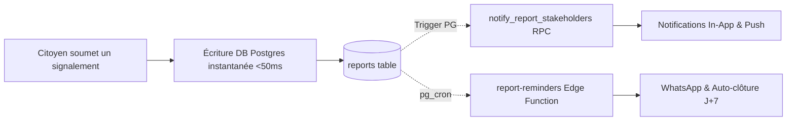

# 🚀 Feuille de Route de Scalabilité & Haute Performance — SIGNA-CI

Ce document présente la stratégie technique d'optimisation et de passage à l'échelle pour permettre à SIGNA-CI de supporter des pics d'affluence viraux (milliers de signalements simultanés lors d'incidents majeurs ou passages médias).

---

## 1. 🗄️ Scalabilité de la Base de Données (PostgreSQL / Supabase)

### A. Indexation & Élimination des Scans Séquentiels (Seq Scans)
- **Index composites existants :**
  - `idx_reports_category_status_created` sur `(report_category, status, created_at DESC)`
  - `idx_reports_commune_validated_status` sur `(commune, validated, status)`
  - `idx_reports_ticket_code` pour la recherche instantanée de tickets `SIG-XXX-YYYYMMDD-0001`
  - `idx_reports_geom USING GIST` pour les requêtes géospatiales PostGIS (`ST_DWithin`).
- **Optimisations recommandées à forte charge (>100k lignes) :**
  - Index partiel sur les signalements actifs :  
    ```sql
    CREATE INDEX CONCURRENTLY IF NOT EXISTS idx_reports_active_only 
    ON public.reports (commune, service_type, created_at DESC) 
    WHERE status IN ('active', 'chronic');
    ```
  - Indexation des clés étrangères RLS (`user_id`, `report_id`) sur les tables `report_comments`, `report_support_votes`, `notifications`.

### B. Optimisation des Politiques RLS (Row Level Security)
- Utilisation de fonctions `SECURITY DEFINER` encapsulées (`get_public_infrastructure_reports`, `get_commune_quartier_stats`) pour les consultations publiques agrégées, évitant l'évaluation répétée de règles RLS ligne par ligne sur des milliers d'enregistrements.
- Déclaration stricte `SET search_path = public` sur l'ensemble des fonctions SQL.

---

## 2. 🖼️ Traitement & Distribution des Médias (Photos Terrain)

### A. Compression & Dé-identification Côté Client
- **Avant l'envoi :** Le composant `PhotoUpload.tsx` rééchantillonne et compresse les photos via HTML5 Canvas (résolution max 1600px, JPEG adaptatif ~200-300 Ko).
- **Sécurité & Confidentialité :** Le passage par Canvas supprime intégralement les métadonnées EXIF sensibles avant l'upload.
- **Dédoublonnage :** Calcul du hash SHA-256 (`photo_fingerprints`) côté client et en base pour bloquer le spam d'images dupliquées.

### B. CDN & Caching Edge
- Utilisation des URLs publiques de Supabase Storage couplées au CDN Cloudflare / Fastly avec en-têtes `Cache-Control: public, max-age=31536000, immutable`.
- Lazy loading natif `loading="lazy"` et décodage asynchrone `decoding="async"` sur toutes les balises ``.

---

## 3. ⚡ Traitements Asynchrones & Gestion des Files d'Attente



- **Découplage immédiat :** L'utilisateur reçoit une confirmation immédiate (< 100ms) dès l'insertion du signalement en base.
- **Tâches en arrière-plan :**
  - La relance WhatsApp, les notifications aux voisins et le basculement chronique J+14 sont pilotés de manière asynchrone par `pg_cron` et l'Edge Function Deno `report-reminders`.
  - L'auto-clôture des coupures obsolètes (>7j) s'exécute via la tâche planifiée `auto-close-stale-outages-daily`.

---

## 4. 📦 Stratégie de Caching & Allègement du Bundle Front-End

### A. Données Statiques & Cadastre PADA
- Les 11 456 voies cadastrales et numéros de porte sont isolés dans un chunk Vite dédié `data-pada-cadastre` chargé à la demande.
- Mise en cache PWA via Service Worker (Cache-First pour les assets immuables, Network-First avec fallback offline pour l'API).

### B. Support Réseau Faible (Mode Hors-Ligne & 3G)
- Sauvegarde locale automatique des signalements en cas de coupure de connexion (`indexedDB` / `localStorage`).
- Barre d'état hors-ligne `OfflineBar` et synchronisation transparente dès le rétablissement de la connexion.

---

## 5. 🎯 Indicateurs Cibles de Performance (SLOs)

| Métrique | Cible |
| :--- | :--- |
| **Temps de chargement initial (LCP)** | < 1.8s sur réseau 4G Abidjan |
| **Temps d'envoi d'un signalement** | < 800ms (avec photo compressée) |
| **Capacité de charge simultanée** | 5 000 requêtes / minute sans dégradation |
| **Disponibilité globale** | 99.9% Uptime |
